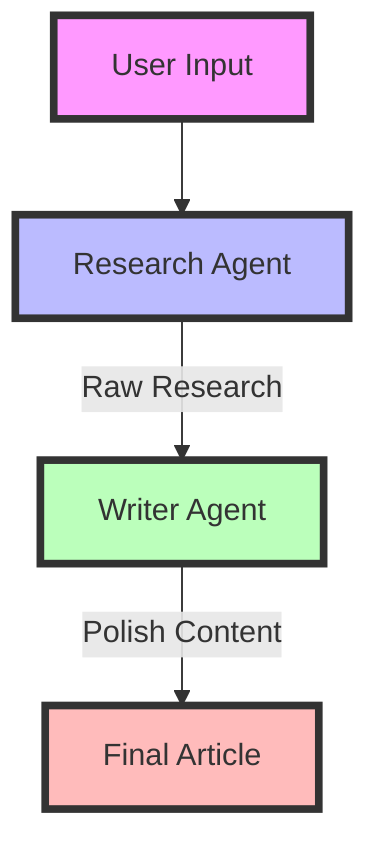
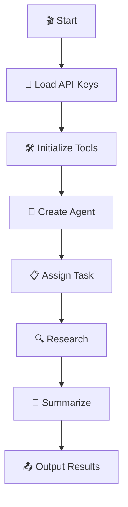
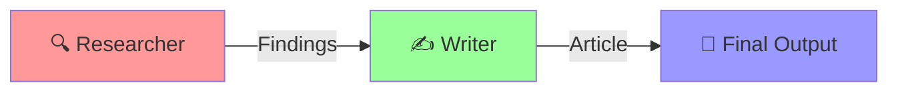

# 🤖 Agentic AI Project: Single and Multi-Agent Systems for Research

## 🔍 Single Agent System

### 🎯 Purpose & Benefits
The single agent system (`single_agent.py`) is designed for:
- 🎯 **Focused Research Tasks**: Perfect for well-defined, specific research topics
- 🚀 **Quick Turnaround**: Streamlined process with a single agent handling everything
- 💡 **Consistent Output**: One agent maintaining the same style throughout
- 📊 **Resource Efficiency**: Lower computational overhead compared to multi-agent systems

#### 🔥 Ideal Use Cases:
- 📝 Quick topic research and summarization
- 🔍 Specific technical documentation needs
- 📊 Market research on specific products/services
- 📚 Educational content creation

### 🛠️ How It Works
1. 🎯 **Topic Input**: User provides a research topic
2. 🔍 **Web Search**: Agent uses SerperDev API to gather information
3. 🧠 **Analysis**: Processes information using Gemini Pro
4. 📝 **Summarization**: Creates a comprehensive, structured summary

## 👥 Multi-Agent System

### 🎯 Purpose & Benefits
The multi-agent system (`multi_agent.py`) leverages specialized agents for:
- 🤝 **Division of Labor**: Each agent focuses on their expertise
- 🎭 **Different Perspectives**: Multiple agents providing varied insights
- 📈 **Enhanced Quality**: Specialized handling of research and writing
- 🔄 **Natural Workflow**: Mimics real-world research team dynamics

#### 🔥 Ideal Use Cases:
- 📰 Creating comprehensive research articles
- 🏥 Healthcare technology analysis
- 💼 Business strategy research
- 🔬 Scientific literature review

### 🛠️ How It Works
1. 🔍 **Research Phase**:
   - Research Agent gathers and analyzes information
   - Focuses on accuracy and comprehensive coverage
   - Creates structured research findings

2. ✍️ **Writing Phase**:
   - Writer Agent takes research findings
   - Transforms technical content into engaging prose
   - Ensures accessibility and readability
   - Produces polished final article

### 🔄 Agent Interaction Flow


## 🤔 Choosing Between Single and Multi-Agent

### 👤 Choose Single Agent When:
- 🎯 Need quick, focused research
- 📊 Working with specific, well-defined topics
- 💰 Resource optimization is important
- ⏱️ Time is a critical factor

### 👥 Choose Multi-Agent When:
- 🎭 Need diverse perspectives
- 📚 Working on complex topics
- 📝 Quality of writing is crucial
- 🔄 Need separation of research and writing

## 📚 Table of Contents

1. [🏗️ Project Structure](#project-structure)
2. [🔍 Single Agent System](#single-agent-system)
3. [👥 Multi-Agent System](#multi-agent-system)
4. [⚙️ Setup & Installation](#setup--installation)
5. [🔑 Environment Setup](#environment-setup)
6. [📝 Usage Guide](#usage-guide)

## 🏗️ Project Structure

```plaintext
Multi-Agent-Project/
├── 🤖 single_agent.py    # Single researcher agent
├── 👥 multi_agent.py     # Multi-agent research crew
├── 🔐 .env               # API keys & configuration
└── 📘 README.md          # Documentation
```

## 🔍 Single Agent System

### 🎯 Purpose
A standalone AI researcher that can:
- 📥 Accept any research topic
- 🌐 Search the internet for relevant information
- 🧠 Process and analyze findings
- 📤 Generate comprehensive summaries

### 🛠️ Tools & Technologies
- **🔌 Core Dependencies**
  - `crewai`: Agent management framework
  - `langchain_google_genai`: Gemini Pro integration
  - `SerperDevTool`: Web search capabilities

### 📊 Workflow



## 👥 Multi-Agent System

### 🎯 Purpose
A collaborative AI research team featuring:
- 🔍 **Research Specialist**: Deep-dives into topics
- ✍️ **Content Writer**: Crafts engaging narratives

### 🤝 Agent Collaboration



## ⚙️ Setup & Installation

1. **📥 Clone & Setup**
```bash
git clone https://github.com/yourusername/agentic-ai-project.git
cd agentic-ai-project
```

2. **🔧 Create Virtual Environment**
```bash
python -m venv venv
.\venv\Scripts\activate  # Windows
```

3. **📚 Install Dependencies**
```bash
pip install -r requirements.txt
```

## 🔑 Environment Setup

Create a `.env` file with your API keys:
```plaintext
SERPER_API_KEY=your_serper_key_here
GOOGLE_API_KEY=your_google_key_here
```

## 📝 Usage Guide

### 🤖 Single Agent Mode
```bash
python single_agent.py
```
> 💡 Enter your research topic when prompted

### 👥 Multi-Agent Mode
```bash
python multi_agent.py
```
> 🔄 Watch as the agents collaborate on research and content creation

## 🌟 Features

- 🔄 **Automated Research**: Streamlined information gathering
- 🧠 **AI-Powered Analysis**: Smart insights generation
- 📊 **Structured Output**: Clear, organized results
- 🤝 **Collaborative Agents**: Specialized task handling
- 📱 **User-Friendly**: Simple command-line interface

## 🤝 Contributing

1. 🍴 Fork the repository
2. 🌿 Create your feature branch
3. 💾 Commit your changes
4. 📤 Push to the branch
5. 🎯 Open a Pull Request

## 📜 License

This project is licensed under the MIT License - see the [LICENSE](LICENSE) file for details.

---
### 🌟 Made with AI, Powered by CrewAI and Gemini Pro 🚀